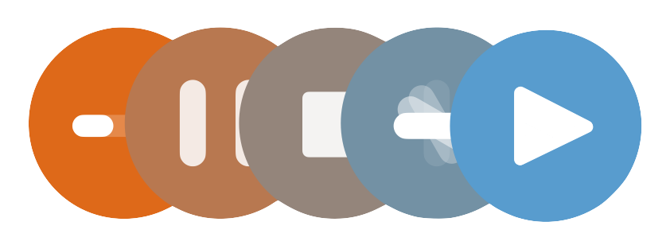

# PlayButton

A button that can render four different playback related modes and animate between them.



### Installation (Swift Package Manager)

The [Swift Package Manager](https://swift.org/package-manager/) is a tool for automating the distribution of Swift code and is integrated into the `swift` compiler. 

Once you have your Swift package set up, adding PlayButton as a dependency is as easy as adding it to the `dependencies` value of your `Package.swift`.

```swift
dependencies: [
  .package(url: "https://github.com/public-value-tech/play-button.git", .branch("main"))
]
```

### Usage

```swift
import PlayButton

let playButton = PlayButton() // defaults to CGSize(width: 44, height: 44)
playButton.playBufferingBackgroundColor = .systemBlue
playButton.pauseStopBackgroundColor = .systemBlue
playButton.playBufferingTintColor = .white
playButon.pauseStopTintColor = .white

// Animate the mode update
playButton.setMode(.stop, animated: true)

// iOS / macCatalyst 
playButton.addTarget(self, action: #selector(playButtonTapped), for: .touchUpInside))

// tvOS
playButton.addTarget(self, action: #selector(playButtonTapped), for: .primaryActionTriggered)
```

<p align="center">
  
</p>
<p align="center">
  
</p> 

### Documentation

Check out the [documentation](https://public-value-tech.github.io/v1.0.0/documentation/playbutton/index.html) or just compile it yourself when you add the package to your projects.
The documentation is created using [docc2html](https://github.com/DoccZz/docc2html) and served via Github Pages until Swift 5.6 drops and we can hopefully use `transform-for-static-hosting` on the [docc compiler directly](https://forums.swift.org/t/support-hosting-docc-archives-in-static-hosting-environments/53572). If the folks at [Swift Package Index](https://swiftpackageindex.com) decide to host the documentation directly, we will add support for this package as well.   

### Tests

The tests mostly consist of snapshot tests. We use a `CADisplayLink` to sample some frames from the animation and diff them against reference snapshots. Since there is some expected deviation we add some tolerance to the tests.
